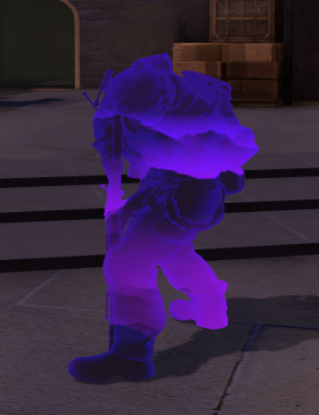
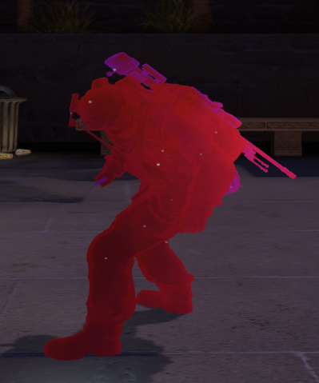

# Skybox Chams

[**SHOWCASE**](https://www.youtube.com/watch?v=H9TGFxgOUSE)

[**MATERIAL DOWNLOAD**](https://github.com/stqcky/AimwareScripts/tree/master/Skybox%20Chams/materials)

[**HOW TO CREATE MATERIALS**](https://www.youtube.com/watch?v=GSKdvLKcuOg&t=0s)

Drop your materials in {csgo folder}/csgo/materials/skybox_chams (create a folder if it doesn't exist)
Local attachment chams apply to all players due to API limitations. If you don't like that use "hide attachments".

[**PRIMORDAL SCRIPT**](https://primordial.dev/resources/skybox-chams.443/)
